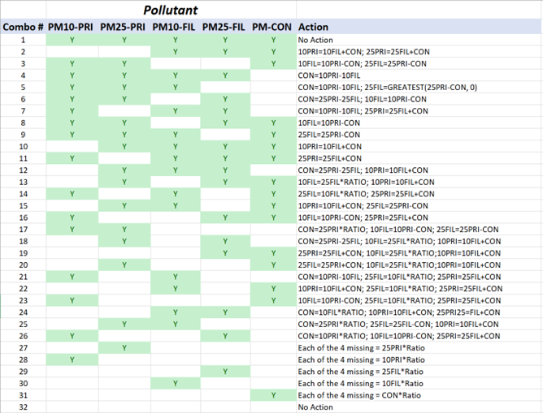

# 2020 NEI contents overview {#overview}

## What are EIS sectors?

First used for the 2008 NEI, EIS Sectors continue to be used for all 2020 NEI data categories. The sectors were developed to better group emissions for both CAP and HAP summary purposes. The sectors are based simply on grouping the emissions by the emissions process as indicated by the SCC to an EIS sector. In building this list, we gave consideration not only to the types of emissions sources our data users most frequently ask for, but also to the need to have a relatively concise list in which all sectors have a significant amount of emissions of at least one pollutant. The SCC-EIS Sector cross-walk used for the summaries provided in this document is available for download from the ["Source Classification Codes (SCCs) website"](https://ofmpub.epa.gov/sccwebservices/sccsearch/). No changes were made to the SCC-mapping or sectors used for the 2020 NEI except where SCCs were retired, or new SCCs were added. 

Some of the sectors include the nomenclature “NEC,” which stands for “not elsewhere classified.” This simply means that those emissions processes were not appropriate to include in another EIS sector and their emissions were too small individually to include as its own EIS sector.

Since the 2008 NEI, the inventory had been reported and compiled in EIS using five major data categories: point, nonpoint, onroad, nonroad and events. The event category was used to compile day-specific data from prescribed burning and wildfires. While events could be other intermittent releases such as chemical spills and structure fires, prescribed burning and wildfires had been a focus of the NEI creation effort and were the only emission sources contained in the event data category. 

For the 2020 NEI, we have aggregated the wildfires and prescribed burning emissions into county-level estimates and loaded these into the nonpoint data category. Table 2 1 shows the EIS sectors or source category component of the EIS sector in the left most column. EIS data categories -Point, Nonpoint, Onroad, Nonroad, and Events- that have emissions in these sectors/source categories are also reflected.
As Table 2 1 illustrates, many EIS sectors include emissions from more than one EIS data category because the EIS sectors are compiled based on the type of emissions sources rather than the data category. Note that the emissions summary sector “Mobile – Aircraft” is reported partly to the point and partly to the nonpoint data categories and “Mobile – Commercial Marine Vessels” and “Mobile – Locomotives” are reported to the nonpoint data category. NEI users who aggregate emissions by EIS data category rather than EIS sector should be aware that these changes will give differences from historical summaries of “nonpoint” and “nonroad” data unless care is taken to assign those emissions to the historical grouping. 

As Table \@ref(tab:EISsector-EISdatacategory) illustrates, many EIS sectors include emissions from more than one EIS data category because the EIS sectors are compiled based on the type of emissions sources rather than the data category. Note that the emissions summary sector “Mobile – Aircraft” is reported partly to the point and partly to the nonpoint data categories and “Mobile – Commercial Marine Vessels” and “Mobile – Locomotives” are reported to the nonpoint data category. NEI users who aggregate emissions by EIS data category rather than EIS sector should be aware that these changes will give differences from historical summaries of “nonpoint” and “nonroad” data unless care is taken to assign those emissions to the historical grouping. 

```{r, include=FALSE}
df <- read_excel("./tables/Section-2/EISsector-EISdatacategory.xlsx")
df[is.na(df)] <- ""
```

```{r EISsector-EISdatacategory, echo=FALSE}
knitr::kable(
  df, longtable = TRUE, booktabs = TRUE,
  caption = 'EIS sectors/source categories with EIS data category emissions reflected.'
)
```

## How is the NEI constructed?

Data in the NEI come from a variety of sources. The emissions are predominantly from S/L/T agencies for both CAP and HAP emissions. In addition, the EPA quality assures and augments the data provided by states to assist with data completeness, particularly with the HAP emissions since the S/L/T HAP reporting is voluntary. 

The NEI is built by data category for point, nonpoint, nonroad mobile, and onroad mobile. Each data category contains emissions from various reporters in multiple datasets which are blended to create the final NEI “selection” for that data category. Each data category selection includes S/L/T data and numerous other datasets that are discussed in more detail in each of the following sections in this document. In general, S/L/T data take precedence in the selection hierarchy, which means that it supersedes any other data that may exist for a specific county/tribe/facility/process/pollutant. In other words, the selection hierarchy is built such that the preferred source of data, usually S/L/T, is chosen when multiple sources of data are available. There are exceptions, to this general rule, which arise based on quality assurance checks and feedback from S/L/Ts that we will discuss in later sections. 

The EPA uses augmentation and additional EPA datasets to create the most complete inventory for stakeholders, for use in such applications as AirToxScreen, air quality modeling, national rule assessments, international reporting, and other reports and public inquiries. Augmentation to S/L/T data, in addition to EPA datasets, fill in gaps for sources and/or pollutants often not reported by S/L/T agencies. The basic types of augmentation are discussed in the following sections.

### Toxics Release Inventory Data

The EPA used air emissions data from the 2020 ["Toxics Release Inventory"](https://www.epa.gov/tri) (TRI) to supplement point source HAP and NH3 emissions provided to EPA by S/L/T agencies. For 2020, all TRI emissions values that could reasonably be matched to an EIS facility with some certainty and with limited risk of double-counting nonpoint emissions were loaded into the EIS for viewing and comparison if desired, but only those pollutants that were not reported anywhere at the EIS facility by the S/L/T agency were included in the 2020 NEI. 

The TRI is an EPA database containing data on disposal or other releases including air emissions of over 650 toxic chemicals from approximately 21,000 facilities. One of TRI’s primary purposes is to inform communities about toxic chemical releases to the environment. Data are submitted annually by U.S. facilities that meet TRI reporting criteria. Section 3 (Point Data category) provides more information on how TRI data was used to supplement the point inventory.

### Chromium Speciation

The 2020 reporting cycle included 5 valid pollutant codes for chromium, as shown in Table \@ref(tab:Cr-speciation).

```{r, include=FALSE}
df <- read_excel("./tables/Section-2/Cr-speciation.xlsx")
df[is.na(df)] <- ""
```

```{r Cr-speciation, tidy=FALSE, echo=FALSE}
knitr::kable(
  df, longtable = TRUE, booktabs = TRUE,
  caption = 'Valid chromium pollutant codes.'
)
```

In the above table, all pollutants but “chromium” are considered speciated, and so for clarity, chromium (pollutant 7440473) is referred to as “total chromium” in the remainder of this section. Total chromium could contain a mixture of chromium with different valence states. Since one key inventory use is for risk assessment, and since the valence states of chromium have very different risks, speciated chromium pollutants are the most useful pollutants for the NEI. Therefore, the EPA speciates S/L/T-reported and TRI-based total chromium into hexavalent chromium and non-hexavalent chromium. Hexavalent chromium, or Chromium (VI), is considered high risk and other valence states are not. Most of the non-hexavalent chromium is trivalent chromium (Chromium III); therefore, the EPA characterized all non-hexavalent chromium as trivalent chromium. The 2020 NEI does not contain any total chromium, only the speciated pollutants shown in Table 2 2.

This section describes the procedure we used for speciating chromium emissions from total chromium that was reported by S/L/T agencies. 

We used the EIS augmentation feature to speciate S/L/T agency reported total chromium. For point sources, the EIS uses the following priority order for applying the factors:

  1)	By Process ID
  2)	By Facility ID
  3)	By County
  4)	By State
  5)	By Emissions Type (for NP only)
  6)	By SCC
  7)	By Regulatory Code
  8)	By NAICS
  9)	A Default value if none of the others apply

If a particular emissions source of total chromium is not covered by the speciation factors specified by any of the first 8 attributes, a default value of 34 percent hexavalent chromium, 66 percent trivalent chromium is applied.

For the 2020 chromium augmentation, only the “By Facility ID” (2), “By SCC” (6), and “By Default” (9) were used on S/L/T-reported total chromium values. For TRI dataset chromium, the “By NAICS” (8) option was primarily used, although a small number of “By Facility” (2) occurrences were used rather than NAICS. The EIS generates and stores an EPA dataset containing the resultant hexavalent and trivalent chromium species. For all other data categories (e.g., nonpoint, onroad and nonroad), chromium speciation is performed at the SCC level.

This procedure generated hexavalent chromium (Chromium (VI)) and trivalent chromium (Chromium III), and it had no impact on S/L/T agency data that were provided as one of the speciated forms of chromium. The sum of the EPA-computed species (hexavalent and trivalent chromium) equals the mass of the total chromium (i.e., pollutant 7440473) submitted by the S/L/T agencies.

The EPA then used this dataset in the 2020 NEI selection by adding it to the data category-specific selection hierarchy and by excluding the S/L/T agency unspeciated chromium from the selection through a pollutant exception to the hierarchy. 

Most of the speciation factors used in the 2020 NEI are SCC-based and are the same as were used in 2011 through 2017 NEI, based on data that have long been used by the EPA for NATA and other risk projects. However, some values are updated with every inventory cycle. New data may be developed by OAQPS during rule development or review of Air Toxics Screening Assessments. The speciation factors are accessed in the EIS through the reference data link “Augmentation Profile Information.” A chromium speciation “profile” is a set of output multiplication factors for a type of emissions source. The profile data for chromium are stored in the same tables as the HAP augmentation factors described in  Section 2.2.3. The speciation factors are a specific case of HAP augmentation whereby the “output pollutants” are always hexavalent chromium and trivalent chromium, and the “input pollutant” is always chromium. There are 3 main tables and a summary table. The summary table excludes the metadata and comments regarding the derivation of the factors and assignment to SCCs; to learn more of the derivation of the factor or assignment of “profile” to a source, the main tables (not summary table) should be consulted.

The three main tables are:

- Augmentation Profile Names and Input Pollutants – general information about the profile and source of the profile names and factors.
- Augmentation Multiplication Factors – provides the output pollutants and multiplication factors associated with a given Augmentation Profile and input pollutant.
- Augmentation Assignments – provides the assignment of the profile to the data source (the list of 9 items above).

The summary table is the Augmentation Multiplication Factors and Assignments, a composite table that provides a view of all the combinations of output pollutants and assignment information associated with a given profile. 

For non-EIS users, the data from the main tables were downloaded and provided as described in Section 3 (3.1.4-S/L/T chromium speciation, 3.1.5 – TRI chromium speciation and 3.1.6, HAP augmentation).

### HAP Augmentation

The EPA supplements missing HAPs in S/L/T agency-reported data. HAP emissions are calculated by multiplying appropriate surrogate CAP emissions by an emissions ratio of HAP to CAP emission factors. For the 2020 NEI, we augmented HAPs for the point and nonpoint data categories. Generally, for point sources, the CAP-to-HAP ratios were computed using uncontrolled emission factors from the ["WebFIRE database"](https://www.epa.gov/electronic-reporting-air-emissions/webfire) (which contains primarily ["AP 42"](C:\Users\RMASON\Documents\FY2017\NEI team\2014 NEI\TSD and Supporting Materials\FINAL\AP42) emissions factors). For nonpoint sources, the ratios were computed from the EPA-generated nonpoint data, which contain both CAPs and HAPs where applicable.

HAP augmentation is performed on each emissions source (i.e., specific facility and process for point sources, county and process level for nonpoint sources) using the same EIS augmentation feature as described in chromium speciation. However, unlike chromium speciation, there is no default augmentation factor so that not every process that has S/L/T CAP data will end up with augmented HAP data.

HAP augmentation input pollutants are S/L/T-submitted VOC, PM10-PRI, PM25-PRI, SO2, and PM10-FIL. The resulting output can be a single output pollutant or a full suite of output pollutants. Not every source that has a CAP undergoes HAP augmentation (i.e., livestock NH3 and fugitive dust PM25-PRI). The sum of the HAP augmentation factors typically does not equal 1 (100%) because not all of the VOC or PM mass will be a HAP.  We try to ensure that the sum of HAP-VOC factors is less than 1 because it can’t be more but it is sometimes close or equal to 1.  HAP augmentation factors based on PM mass are typically much less than 1 for almost all SCCs. HAP augmentation factors are grouped into profiles that contain unique output pollutant factors related to a type of source. Assigning these profiles to the individual sources depends on the source attributes, commonly the SCC.

There are business rules specific to each data category discussed in the point (Section 3.1.6) and nonpoint sections of the TSD. The ultimate goal is to prevent double-counting of HAP emissions between S/L/T data and the EPA HAP augmentation output, and to prevent, where possible, adding HAP emissions to S/L/T-submitted processes that are not desired. NEI developers use their judgment on how to apply HAP augmentation to the resulting NEI selection. 

_Caveats_

HAP augmentation does have limitations; HAP and CAP emission factors from WebFIRE do not necessarily use the same test methods. In some situations, the VOC emission factor is less than the sum of the VOC HAP emission factors. In those situations, we normalize the HAP ratios so as not to create more VOC HAPs than VOC. We are also aware that there are many similar SCCs that do not always share the same set of emission factors/output pollutants. We do not apply ratios based on emission factors from similar SCCs other than for mercury from combustion SCCs. We would prefer to get HAPs reported from S/L/T agencies or from facility reports to the Toxics Release Inventory, but HAP augmentation is used as a last available option.  Compliance test data does not usually provide an annual emissions total.

Because much of the AP-42 factors are 20+ years old, many incremental edits to these factors have been made over time. We have removed some factors based on results of NATA reviews. For example, we discovered ethylene dichloride was being augmented for SCCs related to gasoline distribution. This pollutant was associated with leaded gasoline which is no longer used. Therefore, we removed it from our HAP augmentation between 2011 NEI v2 and 2014. We also received specific facility and process augmentation factors resulting from the NATA and AirToxScreen reviews. More discussion of the underlying data used for the 2020 NEI Point inventory is discussed in Section 3.1.6.

For point sources, HAPs augmentation data are not used when S/L/T air agency data exists at any process at the facility for the same pollutant. That means that if a S/L/T reports a particular HAP at some processes but misses others, then those other processes will not be augmented with that HAP. 

### Particulate Matter Augmentation

Particulate matter (PM) emissions species in the NEI are primary PM10 (pollutant code PM10-PRI in the EIS and NEI) and primary PM2.5 (PM25-PRI), filterable PM10 and filterable PM2.5 (PM10-FIL and PM25-FIL) and condensable PM (PM-CON). The EPA needs to augment the S/L/T agency PM components for the point and nonpoint inventories to ensure completeness of the PM components in the final NEI. In general, emissions for PM components missing from S/L/T agency inventories were calculated by applying factors to the PM emissions data supplied by the S/L/T agencies.

PM Augmentation is only run in EIS for point and nonpoint sources. Unlike the PM calculator/Augmentation tool used in previous NEIs, EIS PM Augmentation only gap-fills missing PM components, and does not overwrite existing S/L/T PM data, which already undergoes rudimentary EIS QA checks as the data is being loaded into EIS. 

The complete set of conditional logic statement used in EIS PM Augmentation are displayed in Figure \@ref(fig:PM-aug).

```{r PM-aug, fig.cap="PM Augmentation computations based on S/L/T submitted pollutants", fig.alt="This figure shows PM Augmentation computations based on S/L/T submitted pollutants.", echo=FALSE}

```

### Other EPA Datasets

In addition to TRI, chromium speciation, HAP and PM augmentation, the EPA generates other data to produce a complete inventory. New for 2020, as part of the NEI selection process, EIS generates speciated PM2.5 emissions for all sources with PM emissions. These PM species are a result of speciation where the NEI PM25-PRI emissions are split into five PM2.5 species: elemental (also referred to as “black”) carbon (EC), organic carbon (OC), nitrate (NO3), sulfate (SO4), and the remainder of PM25-PRI (PMFINE). In addition, a copy of PM25-PRI and PM10-PRI from mobile source diesel engines, relabeled as DIESEL-PM25 and DIESEL-PM10, respectively, are also generated. 

Examples of other EPA data for point sources, discussed in Section 3, include commercial sterilizers amended via AirToxScreen review, landfills, railyards, electric generating units (EGUs), and aircraft. 

### Data Tagging

S/L/T agency data generally is used first when creating the NEI selection. When S/L/T data are used, then the NEI would not use other data (primarily EPA data from stand-alone datasets or HAP, PM or TRI augmentation) that also may exist for the same process/pollutant. Thus, in most cases the S/L/T agency data are used; however, for several reasons, sometimes we need to exclude, or “tag out” S/L/T agency data. Examples of these "S/L/T tags” are when S/L/T agency staff alert the EPA to exclude their data (because of a mistake or outdated value), or when EPA staff find problems with submitted data. Another example is when S/L/T emissions data are significantly less than TRI and are presumed to be incomplete, which can happen for S/L/T that use automated gap-filling procedures for facilities that do not voluntarily provide HAP emissions. These automated procedures gap-fill only for processes that have emission factors and miss processes/pollutants that may have been reported to TRI using other means besides published emission factors.

In previous NEI years data tagging had also been used to avoid double-counting emissions by using emissions from more than one dataset because the two datasets were at different levels of granularity and thus not able to be integrated to the full process level of detail required by the standard selection hierarchy software. The primary example of this is the TRI dataset, which provides facility-total emissions rather than individual process-level emissions. Because the TRI emissions must be stored to a single emission process that is not the same as that used by the S/L/T agency, the standard hierarchy selection software would use both. Thus, tagging was used to “block” any TRI values where the S/L/T had reported the same pollutant at any process(es) within the same facility. Since the 2017 NEI, a series of additional rules were added to the selection hierarchy to avoid such tagging. Point source datasets are identified as being either Process-level, Unit-level, or Facility-level granularity, and the selection software now uses those identifications to avoid double-counting, avoiding the need for those types of tags.

### Inventory Selection

Once all S/L/T and EPA data are quality assured in the EIS, and all augmentation and data tagging are complete, then we use the EIS to create a data category-specific inventory selection. To do this, each EIS dataset is assigned a priority ranking prior to running the selection with EIS. The EIS then performs the selection at the most detailed inventory resolution level for each data category. For point sources, this is the process and pollutant level. For nonpoint sources, it is the process (SCC)/shape ID (i.e., ports) and pollutant level. For onroad and nonroad sources, it is process/pollutant, and for events it is day/location/process and pollutant. At these resolutions, the inventory selection process uses data based on highest priority and excludes data where it has been tagged. The EPA then quality assures this final blended inventory to ensure expected processes/pollutants are included or excluded. The EIS uses the inventory selection to also create the SMOKE Flat Files, EIS reports and data that appear on the NEI website.

## What are the sources of data in the 2020 NEI?

This section shows the contributions of S/L/T agency data to total emissions for the point and nonpoint data categories. Figure \@ref(fig:Contribution-to-point) shows the proportion of CAP, select HAPs, and HAP group emissions from various data sources in the NEI for point data category sources. Except for PM2.5 and PM10, most point CAP emissions come from S/L/T-submitted data. PM augmentation (see Section 2.2.4), which is based off incomplete S/L/T submittals of PM, accounts for a significant portion of PM point emissions. The data sources shown in the figure are described in more detail in Section 3.

```{r, include=FALSE}
df <- read_csv("./figures/Section-2/NEI2020_Section2_US_dcat_group_Figs_PT.csv")
# Explicitly set the order of the groups
df$Pollutant <- factor(df$Pollutant,levels= c("CO","NH3","NOX","PM10","PM2.5","SO2","VOC","Lead","Mercury","Acid-Gases","HAP-Metal","HAP-VOC"))
df <- df %>%
  group_by(Pollutant) %>%
  mutate(Proportion = Value / sum(Value))
```

```{r Contribution-to-point, fig.cap="Relative contributions for various data sources of Point emissions for CAPs and select HAPs", fig.alt="Weighted bar chart of pollutants by source.", echo=FALSE}
p <- ggplot(df, aes(x = Pollutant, y = Proportion, fill = Source)) +
  geom_bar(stat = "identity", position = "fill") +
  scale_y_continuous(labels = percent_format()) +
  scale_fill_brewer(palette = "Dark2") +  # Use a Brewer2 palette
  theme_minimal() +
  theme(axis.text.x = element_text(angle = 45, hjust = 1))
print(p)
ggsave("figures/Section-2/NEI2020_Section2_US_dcat_group_Figs_PT.png",plot=p,width=6,height=4,bg="white")
```

<a href="figures/Section-2/NEI2020_Section2_US_dcat_group_Figs_PT.png" download="figures/Section-2/NEI2020_Section2_US_dcat_group_Figs_PT.png" class="btn btn-primary">Download Figure</a>

Figure 2 3 shows the proportion of CAP, select HAPs, and HAP group emissions from various data sources in the NEI for nonpoint data category sources. Biogenic sources, all EPA data, are not included in this table. Acid Gases include the following pollutants: hydrogen cyanide, hydrochloric acid, hydrogen fluoride, and chlorine. HAP VOC emissions consist of dozens of VOC HAP species, that in-aggregate, should be less than VOC in our QA checks. HAP metal emissions consist of the following compound groups: Antimony, Arsenic, Beryllium, Cadmium, Chromium, Cobalt, Lead, Manganese, Mercury, Nickel and Selenium. More than 50% of nonpoint pollutant totals come from some type of EPA source; however, as discussed in Section 6, S/L/T-submitted nonpoint activity data is absorbed into EPA nonpoint tools and are therefore classified as “EPA” data. Nonpoint NH3 is dominated by the agricultural livestock waste and fertilizer application sectors. The large “EPA Nonpoint” bars for PM10 and PM2.5 are predominantly dust sources from unpaved roads, agricultural dust from crop cultivation, and construction dust.

We did not compute relative contributions of emissions from nonroad and onroad data categories because of the nature in how emissions are created for these sources -via a mix of S/L/T and EPA activity data and processed through the MOVES model. California, which uses its own onroad and nonroad mobile models, was the only state that provided emissions rather than inputs for EPA models (this is in accordance with the AERR). All other states were required to provide inputs to the EPA models. Onroad and nonroad mobile data categories use the MOVES emissions model, and the EPA primarily collected model inputs from S/L agencies for these categories and ran the models using these inputs to generate the emissions. The S/L agencies that provided inputs are presented in the nonroad and onroad portions of the document, Section 4 and Section 5, respectively.

##	What are the top sources of some key pollutants?

Table 2 3 provides a summary of CAP and total HAP emissions for all EIS sectors, including the biogenic emissions from vegetation and soil. Emissions in federal waters and from vegetation and soils have been split out and totals both with and without these emissions are included. Emissions in federal waters include offshore drilling platforms and commercial marine vessel emissions outside the typical 3-10 nautical mile boundary defining state waters. All emissions values are bounded by the caveats and methods described by this documentation.

##	How does this NEI compare to past inventories?

Many similarities exist between the 2020 NEI approaches and past NEI approaches, notably that the data are largely compiled from data submitted by S/L/T agencies for CAPs, and that the HAP emissions are augmented by the EPA to differing degrees depending on geographical jurisdiction because they are a voluntary contribution from the partner agencies. In 2020, S/L/T participation was again somewhat more comprehensive than the previous NEI. The NEI program continues with the 2020 NEI to work towards a complete compilation of the nation’s CAPs and HAPs. The EPA provided feedback to S/L/T agencies during the compilation of the data on critical issues (such as potential outliers, missing SCCs, missing Hg data and coke oven data) as has been done in the past, collected responses from S/L/T agencies to these issues, and improved the inventory for the release based on S/L/T agency feedback. In addition to these similarities, there are some important differences in how the 2020 NEI has been created and the resulting emissions, which are described in the following two subsections.

### Differences in approaches

With any new inventory cycle, changes to approaches are made to improve the process of creating the inventory and the methods for estimating emissions. The key changes for the 2020 cycle are highlighted here.

To improve the process, we learned from the prior triennial inventories (for 2008, 2011, 2014, and 2017) compiled with the EIS. We made changes to pollutant, SCC, and NAICS codes, refined quality assurance checks and features that were used to assist in quality assurance but retained the same Nonpoint Survey functionality used in the 2017 NEI (introduced for the 2014 NEI) to assist with S/L/T and EPA data reconciliation for the nonpoint data.

In addition to process changes, we improved emissions estimation methods for all data categories. We summarize the differences in approaches in the following sections.

#### Point data category

For point sources, the only major change for 2020 was our incorporation of the Air Toxics Screening (AirToxScreen) assessment between the draft NEI and this 2020 NEI release. AirToxScreen provided SLTs a review of high-risk air toxic facilities. More information on point source improvements is available in Section 3.

#### Nonpoint data category

We made method improvements for several stationary nonpoint sectors (Section 6). The EPA creates and provides emissions estimation tools for two purposes: 1) as tools for S/L/T agencies to use themselves, and 2) to backfill emissions values where not provided by S/L/T agencies.

As part of the 2017 NEI development process, we introduced “Input Templates” for S/L/Ts to provide activity data for several nonpoint data category tools. By allowing a simple template where S/L/Ts can review the previous year’s data, the data source, and easily update values at a county or state level, that then feeds into EPA’s emissions estimation tools, assures that the calculations and methods are identical. For the 2020 NEI, we centralized the input template download and upload process, and enabled S/L/Ts to directly load their inputs into EPA tools to generate draft emission estimates prior to submittal to the NEI. EPA provided default Input Templates to S/L/T inventory developers for them to modify and return to EPA. We encouraged S/L/Ts to submit inputs rather than direct emission submittals for many nonpoint categories. 

We also continued to streamline the Nonpoint Survey (Section 6), first introduced for the 2014 NEI development cycle, to simplify the options and improve transparency. In particular, we added a button on the NP survey that indicates whether an agency submitted an input template. This helped us QA our data twofold: 1) did the agency intend to submit an input template, and 2) did they actually submit a template. By default, all Nonpoint Survey responses were set to “Yes -Supplement my data with EPA Estimates” to ensure complete coverage in the absence of S/L/T feedback. 

As discussed in Section 25, for the 2020 NEI, we added default fuel consumption data for nonpoint Industrial and Commercial/Institutional (ICI) fuel combustion, based partially on S/L/T-submitted Point carbon monoxide emissions; this greatly reduced the potential double-counting of ICI fuel consumption estimates for S/L/Ts that did not submit direct nonpoint emissions or an input template. Similar to the 2017, we continue to use estimated point fuel consumption for reconciling the nonpoint component of ICI fuel consumption/emissions -we no longer allow point emissions subtraction. We provided S/L/Ts with cross-references from point inventory facilities to existing U.S. Energy Information Administration (EIA) ICI sector assignments and fuel mapping. We relied on S/L/Ts to provide EPA with these state-level inputs via 4 different Input Template options. 

Emissions for residential wood consumption (Section 27) were affected by an updated methodology in the wood consumption estimates obtained from the State Energy Data System (SEDS), which reflected updated national survey data and allocation scheme based on heating degree days which distributed emissions from warmer (southern) states to cooler (northern) states. In addition, we updated to use higher PM emission factors for certified wood stoves as the old emissions were deemed inappropriate for continued use.

The methods used to estimate nonpoint solvent utilization emissions (Section 32) were updated using a new emissions model. This model uses national-level product usage estimates to subsequently estimate speciated emissions, that are further allocated to the county-level using geographically specific sources of data and modulated if the locality reports control mechanisms for select SCCs. In addition, a new SCC (2460030999) was added to this category to reflect emissions from lighter fluids, fuel starters, and other consumer product fuel sources.

Most states saw a significant increase in CO, PM2.5 and VOC from commercial cooking, a result of an improvement in the activity data on the number of restaurants. Large decreases in residential fuel combustion for SO2 is a result of a continued decrease in consumption and more significantly, more widespread inclusion of a lower default sulfur content for distillate fuel oil. 

All fires data are now included in the nonpoint data category for the 2020 NEI. This is simply a format issue as the underlying methodology for computing wildland fires (wildfires and prescribed burning) are still developed using satellite data for location and day-specific fires, but for 2020 NEI, are subsequently aggregated to the county-level. Overall, national-level agricultural field burning increased but was mostly offset by corresponding decreases in prescribed fire estimates.

The 2020 NEI introduces (VOC and associated VOC HAPs) from agricultural silage and new asphalt paving processes and methodology. Agricultural fertilizer application (NH3) estimates significantly increased due to several updates: new emission factor measurements, change in how landcover was modeled, improved meteorological data, and an error correction. Oil and gas production increased significantly in the Permian basin; otherwise, most VOC changes result from new Solvents methodology (Section 32), which also includes pesticide application.

For all nonpoint categories, we updated the activity data to use the newest data available, at the time, to represent the 2020 inventory year; in most cases, this is year-2020 activity data. Most emission changes for all nonpoint sources not otherwise discussed in this section resulted from these activity data updates -be they from EPA or new for 2020, provided directly from S/L/Ts.

The Biogenic database incorporated a new version of the Biogenic Emissions Landcover Database (BELD5) and provides updates for all states, including Alaska, Hawaii, Puerto Rico and the U.S. Virgin Islands. 

#### Onroad and nonroad data categories

For mobile sources, onroad methodology used an updated version of the MOVES model with updated mobile source activity data such as vehicle miles travelled (VMT), age distributions, and fuel type mix, and improved idling computations; we also received new telematics data from StreetLight Data, Inc. For both onroad and nonroad, we relied on model inputs provided by S/L/T agencies and other sources, except for California and Tribes, who submitted emissions estimates. Sections 5 (nonroad mobile) and 6 (oroad mobile) provide more detail on these improvements.

###	Differences in emissions between 2020 and 2017 NEI

This section presents a comparison from the 2017 NEI to the 2020 NEI. Table 2 4 compares CAP emissions for the 2020 minus 2017 NEI for seven highly aggregated emission sectors. Table 2 5 compares emissions for select HAPs for the 2020 minus 2017 NEI for the same seven highly aggregated emission sectors. Emissions from the biogenic (natural) sources are excluded, and the wildfire sector is shown separately for CAPs and HAPs. While Pb is a CAP for the purposes of the NAAQS, due to toxic attributes and inclusion in previous national air toxics assessments (NATA) and screenings (Air Toxics Screening) assessements, it is reviewed here with the HAPs. The HAPs selected for comparison are based on their national scope of interest as defined by Air Toxics Screening Assessments. With a couple notable exceptions, CAP emissions are lower overall in 2020 than in 2017. Some specific sector/pollutants increased in 2020 from 2017. 

The increases in fuel combustion for most pollutants are primarily a result of increases in residential wood combustion where the underlying source of activity data (fuel consumption) increased significantly via methodology and geographic distribution changes. Conversely, the significant decrease in electric generating unit (EGU) emissions account for the decrease in overall NOX and SO2 fuel combustion. Increases in Miscellaneous CO are from increased prescribed and agricultural field burning. Increases in nonroad gasoline engine lawn and garden and commercial estimates explain the increases in Nonroad Mobile CO. Large increases in agricultural fertilizer application explain the large Miscellaneous NH3 increase. Large Industrial Processes VOC increases are primarily from increased oil and gas activity in the Permian Basin. 

As expected, the pandemic contributed to significant decreases in 2020 for all Highway Vehicle pollutants. As discussed in Section 7, there were comparatively more wildfires in 2020 than 2017, explaining the significant increases in wildfire emissions for 2020. Year 2017 was a generally quiet year for such fires.